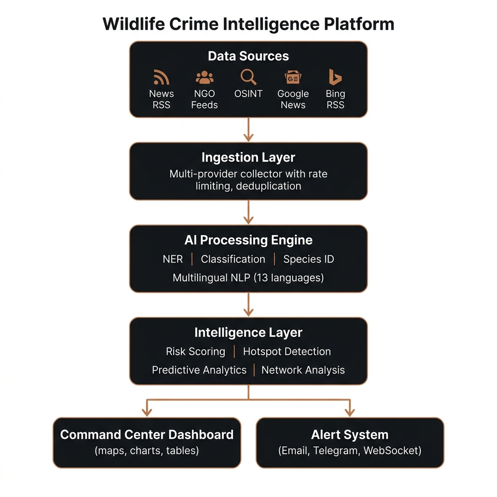
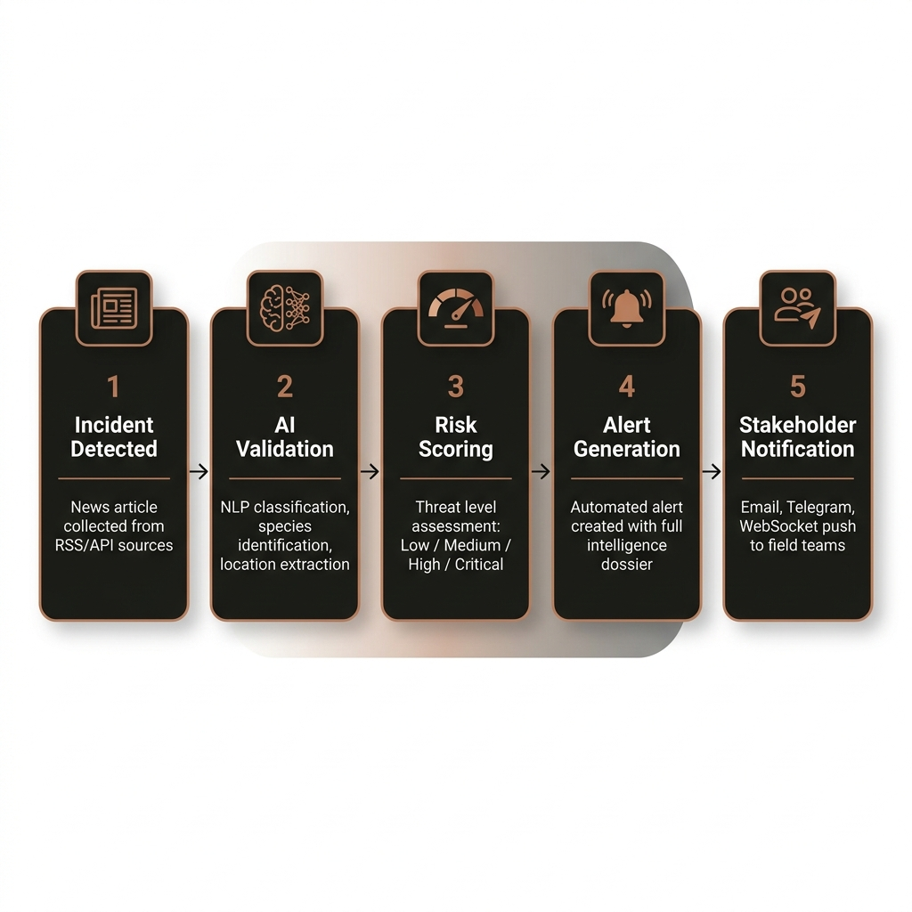

<div align="center">

# 🐾 Wildlife Intelligence Platform

### Real-Time Poaching & Wildlife Crime Intelligence System

**Developed in Collaboration with the Wildlife Trust of India (WTI)**

[](https://www.wildlifenews.me)
[](https://python.org)
[](https://reactjs.org)
[](https://fastapi.tiangolo.com)
[](https://github.com/Siddhanthkjain2005/Wildlife-News/actions)
[](LICENSE)

<br/>

**An AI-powered, multi-source intelligence platform that monitors, analyzes, and visualizes wildlife poaching incidents across India in real-time — built for conservation officers, wildlife researchers, and law enforcement agencies.**

<br/>


</div>

---

## 🎯 The Problem

Every year, India loses thousands of endangered animals to poaching and illegal wildlife trade. Law enforcement and conservation teams struggle with:

- **Fragmented intelligence** — poaching incidents are reported across hundreds of regional news sources in multiple regional languages
- **Slow response times** — manual monitoring misses critical incidents by hours or days
- **No centralized system** — no single platform aggregates, analyzes, and maps wildlife crime data in real-time

## 💡 The Solution

**Wildlife Intelligence Platform** is a production-grade, AI-powered system that continuously monitors regional news feeds, extracts structured intelligence from unstructured articles, and presents actionable insights through a unified command-center dashboard.

Developed in collaboration with the **Wildlife Trust of India (WTI)**, this platform bridges the gap between unstructured field reports/news and active law enforcement.

### What Makes This Different

| Feature | Traditional Approach | This Platform |
|---|---|---|
| **Data Collection** | Manual Google searches | Automated active source ingestion (RSS, APIs, GDELT) |
| **Language Support** | English only | 7 optimized Indian languages including Hindi, Kannada, Tamil, Telugu, Malayalam, Bengali |
| **Analysis** | Human reading | Hybrid Intelligence Engine (NER, zero-shot classification, and risk scoring) |
| **WPA Mapping** | Manual reference | Built-in Wildlife Protection Act (WPA) legal schedules lookup |
| **Chargesheet Drafting** | Manual lookup | Auto-generated legal chargesheet drafts based on incident data |
| **Threat Intelligence** | Historical reports | Predictive hotspot maps, regional threat levels, and species forecasts |
| **Update Frequency** | Daily/weekly | Every 3 minutes, 24/7 with WebSocket live updates |

---

## ⚙️ System Architecture

<div align="center">
  
</div>

Data flows top-to-bottom through five layers: **multi-source ingestion** (RSS, OSINT, news APIs) → **deduplication & rate-limited collection** → a **hybrid AI processing engine** (NER, zero-shot classification, species ID) → a **predictive intelligence layer** (risk scoring, hotspot detection, network analysis) → and finally the **command-center dashboard** and **real-time alert system**.

---

## 🚀 Key Features

### 🤖 Hybrid Intelligence Engine
- **Multi-model AI pipeline**: Rule-based fast-path + mDeBERTa-v3 transformer classifier + optional SetFit classifier.
- **Geographic Attribution**: Maps locations to 300+ Indian districts with fallback logic for local scripts.
- **Person NER Pipeline**: Extract suspect names using Regex + Named Entity Recognition models with a 200+ stopword blocklist to eliminate false positives (like news agencies, dates, or places).

### 🔮 Predictive Threat Intelligence
- **Threat Levels**: Dynamically calculates regional vulnerability ratings (Low, Moderate, Elevated, High, Critical) based on incident frequency, species endangerment level, and local poaching history.
- **Poaching Hotspots**: Identifies high-risk areas to optimize field patrols and resource deployment.
- **Species Vulnerability Trends**: Models and displays which species are currently facing heightened threat profiles.

### ⚖️ WPA Legal Reference Tool & Chargesheet Generator
- **WPA Schedule Reference**: Complete database reference of the Indian Wildlife (Protection) Act, 1972 (with 2022 amendments) mapping species to their respective legal schedules.
- **Draft Chargesheet Generator**: Proactively generates structured legal drafts referencing specific WPA sections, schedules, penalties, and jurisdiction details based on the selected incident data.

### 📊 System Operations & Live Feeds
- **WebSocket Sync**: Real-time feedback loop displaying active scraper sync status, data processing state, and live incident updates.
- **Production Hardening**: Admin settings protected with constant-time token comparison (`hmac.compare_digest`) and HTTP cookies configured with secure production headers.
- **Data Export**: Support for CSV, formatted Excel briefs, and full analyst briefing packs.

---

## 🔔 Incident-to-Alert Workflow

From the moment an article is collected to the instant a field team is notified, every incident passes through a five-stage intelligence pipeline:

<div align="center">
  
</div>

**1. Incident Detected** → news article collected from RSS/API sources · **2. AI Validation** → NLP classification, species identification, location extraction · **3. Risk Scoring** → threat level assessment (Low / Medium / High / Critical) · **4. Alert Generation** → automated alert created with full intelligence dossier · **5. Stakeholder Notification** → Email, Telegram, and WebSocket push to field teams.

---

## 🧠 Large Language Model (LLM) Integration

The platform features an advanced integration with Large Language Models via **Ollama Cloud** (supporting OpenAI-compatible endpoints, Azure, OpenAI, or local instances).

The LLM is deployed across two main components in the system architecture:

### 1. Structured Article Ingestion & Legal Annotation (`app/services/summarizer.py`)
During news ingestion, unstructured article text is processed by the summarizer service using the **`gemma3:27b`** or **`deepseek-v3.1:671b-cloud`** model. The LLM is instructed to act as a *wildlife crime intelligence analyst for the Government of India* and return a **STRICT JSON** representation of the incident.

```python
# System prompt schema returned by the LLM
{
  "is_wildlife_poaching_incident": bool,       # Verifies active poaching/smuggling/trade in India
  "suggested_confidence_score": int,           # Factuality verification score (0-100)
  "llm_classification_reason": str,            # Logic audit trail for classifications
  "summary": str,                              # High-impact 2-3 sentence overview
  "key_facts": list,                           # Structured bulleted fact lists (max 6)
  "smuggling_route": str,                      # Transit routes detected (e.g. state border crossings)
  "wpa_schedule": str,                         # Mapped WPA Schedule (Schedule I/II/III/IV/V/VI)
  "wpa_section": str,                          # Target violations (e.g., Section 9, 39, 49-B, 51)
  "wpa_offence_type": str,                     # Hunting, Possession, Illegal Trade, etc.
  "wpa_penalty_class": str,                    # Severe, moderate, or minor severity
  "protected_area_type": str,                  # Associated Wildlife Sanctuary/National Park
  "enforcement_authority": str,                # State Forest Dept, Police, WCCB, etc.
  "extracted_species": list,                   # Singularized, lowercased English common names
  "extracted_suspects": list,                  # Fully capitalized perpetrator names (filters officers)
  "extracted_location": str                    # Formatted "State, District" geographic target
}
```

#### LLM Prompt Processing Details:
- **Species Mapping**: Automatically translates regional species names to unified English names (e.g., *Chital* → *spotted deer*, *Kala Hiran* → *blackbuck*).
- **Suspect Filtering**: Filters out names of investigating forest officers, SPs, or police inspectors, capturing only the actual suspects/arrested persons.
- **WPA Schedules**: Applies strict guidelines mapping endangered species (Tigers, Leopards, Elephants, Pangolins, Blackbucks) to **Schedule I**, and lesser protected species (Jackals, Monkeys, Cobras) to **Schedule II**.

### 2. Retrieval-Augmented Generation (RAG) Engine (`app/services/rag_engine.py`)
The platform includes an interactive search and briefing tool powered by a RAG pipeline utilizing the **`llama3.3-70b-instruct`** or **`meta-llama-3.1-8b-instruct`** model.

```
                   [ User Query ]
                         │
                         ▼
        ┌──────────────────────────────────┐
        │       Semantic Search            │
        │  Matches vectors in SQLite db    │
        └────────────────┬─────────────────┘
                         │
                         ▼
        ┌──────────────────────────────────┐
        │  Context Ingestion & Filtering   │
        │  Aggregates top incident records │
        └────────────────┬─────────────────┘
                         │
                         ▼
        ┌──────────────────────────────────┐
        │       LLM Synthesis Prompt       │
        │  Instructs to answer only based  │
        │  on structured context entries   │
        └────────────────┬─────────────────┘
                         │
                         ▼
             [ Analyst Briefing Pack ]
          Concise sentences + [ID] citations
```

The LLM formats context files into integrated briefing responses, citing incident IDs in bracketed notations to provide auditable source validation.

---

## 🗣️ Optimized Language Support

To optimize scraping speed and eliminate API rate limits (such as Google RSS 503 cooldowns), the platform's query processor is restricted to **7 high-yield languages**:

| Language | Script | Region Focus |
|---|---|---|
| **English** | Latin | National |
| **Hindi** (हिन्दी) | Devanagari | North / Central India |
| **Kannada** (ಕನ್ನಡ) | Kannada | Karnataka |
| **Tamil** (தமிழ்) | Tamil | Tamil Nadu |
| **Telugu** (తెలుగు) | Telugu | Andhra Pradesh / Telangana |
| **Malayalam** (മലയാളം) | Malayalam | Kerala |
| **Bengali** (বাংলা) | Bengali | West Bengal |

---

## 💻 Tech Stack

- **Backend**: FastAPI, Python 3.11+, SQLAlchemy, SQLite (PostgreSQL-ready via Alembic migrations)
- **AI / NLP**: Hugging Face Transformers (mDeBERTa-v3), SetFit, multilingual NER, Ollama / OpenAI-compatible LLMs
- **Frontend**: React (Vite), Tailwind CSS / Vanilla CSS, Lucide icons, Leaflet (Map)
- **Realtime & Infra**: WebSockets, Nginx, Systemd services, DigitalOcean droplet
- **Quality**: pytest suite (81 tests), GitHub Actions CI, Alembic schema migrations

---

## 🚀 Getting Started

> Requires **Python 3.11+**. The AI models download automatically on first run.

```bash
# 1. Clone the repository
git clone https://github.com/Siddhanthkjain2005/Wildlife-News.git
cd Wildlife-News

# 2. Create a virtual environment and install dependencies
python -m venv .venv
source .venv/bin/activate          # Windows: .venv\Scripts\activate
pip install -r requirements.txt

# 3. Configure environment
cp .env.example .env               # then edit values as needed

# 4. Apply database migrations
alembic upgrade head

# 5. Run the application
uvicorn app.main:app --reload --port 8000
```

The dashboard is then available at **http://localhost:8000**.

```bash
# Run the test suite
pytest tests/ -q
```

For optional AI extras (LLM summarization, RAG, SetFit), install the additional requirements:

```bash
pip install -r requirements-ai.txt
```

---

## 📂 Project Structure

```
app/
├── api/            # FastAPI routers (incidents, dashboard, search, graph, RAG, admin, websocket)
├── services/       # Intelligence engine — collector, classifier, NER, predictor, RAG, summarizer
├── models/         # SQLAlchemy ORM models (news, intelligence, OSINT, audit, reports)
├── repositories/   # Data-access layer with reusable query filters
├── core/           # Config, database, caching, security, realtime, logging
├── workers/        # Background sync manager
└── utils/          # India geo-resolution, location data, text utilities
alembic/            # Database schema migrations
scripts/            # Maintenance, data-cleaning, and training utilities
tests/              # pytest suite (81 tests)
docs/               # Architecture diagrams and documentation
```

---

## 👤 Credits

Developed in partnership with:

* **Wildlife Trust of India (WTI)** - Field expertise, species dataset mappings, and legal parameters.
* **Siddhanth K. Jain** - Software engineering, system architecture, and AI integration.

[](https://github.com/Siddhanthkjain2005)

> *Building technology that makes a real difference in wildlife conservation.*

---

<div align="center">

**⭐ If this project helped you, please give it a star! ⭐**

*Built with ❤️ for wildlife conservation*

</div>
